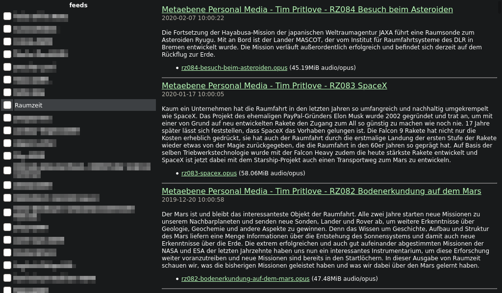

# feedreader
Feed reader with web interface using the [feedparser](https://pythonhosted.org/feedparser/) library as a backend

## How to set up (experienced users only)
* install a webserver
* put feeds.py and db_if.py in its cgi-bin (also make sure, that the webserver has its cgi capability enabled)
* put style.css und icon.png in /feeds/ (relative to the root of the webserver) (can be changed in feeds.py)
* the default location for the database is /var/www/feedreader/feeds.db (you can change the path in feedsd.py)
* open the URL to the feeds.py-script in a webbrowser
* add feeds to the feed list
* run feedsd.py to keep them up to date
